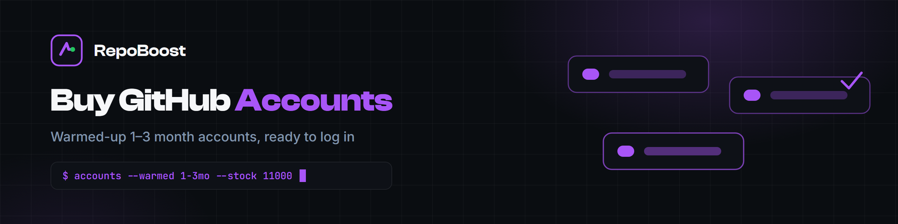

  

  

  
  
  
  
  
  

  
  

# Buy GitHub Accounts - Warmed Up, Ready to Log In

Standard accounts for developers who need working GitHub access fast: 1-3 months old, warmed up, with realistic profiles. Delivered in about a minute with a 24-hour replacement guarantee. 11,000+ in stock.

## ✨ What every account includes

- 1-3 months of age, warmed up and ready
- Realistic profile - name, photo and bio set
- Created on UHQ proxies with premium mailboxes
- Delivered with full access (delivered privately)
- 24-hour replacement guarantee

## 🧠 Stock and speed

| | |
|---|---|
| **In stock** | 11,000+ accounts, updated daily |
| **Average delivery** | about one minute |
| **Replacement** | 24-hour guarantee |
| **Quantities** | single accounts up to bulk orders |

## Ordering, the quality checklist and where to go next

  
  

**How it works:** tap one of the buttons above - pick a quantity - pay - accounts arrive in about a minute. The bot runs 24/7 with live stock; the website carries the full inventory and pricing.

| Every account is checked | |
|---|---|
| **Age and warm-up** | 1-3 months old, already used naturally |
| **Profile realism** | name, photo and bio in place |
| **Clean origin** | UHQ proxies and premium mailboxes |
| **Working access** | full details delivered privately |
| **Coverage** | any account that fails within 24 hours is replaced |

### Where to go next

- [Aged accounts with years of real history](https://buygithub.com/old-github-accounts/?utm_source=github&utm_medium=readme&utm_campaign=buy-github-accounts)
- [Follower credibility from aged accounts](https://buygithub.com/buy-github-followers/?utm_source=github&utm_medium=readme&utm_campaign=buy-github-accounts)
- [Stars for repository visibility](https://buygithub.com/buy-github-stars/?utm_source=github&utm_medium=readme&utm_campaign=buy-github-accounts)

  

## ❓ FAQ

**How fast is delivery?**

About one minute for average orders - 12,847 accounts delivered so far.

**How are the accounts delivered?**

Privately, with full access details, and backed by a 24-hour replacement guarantee. Average delivery is about a minute.

**What can the accounts be used for?**

Development workflows, testing, automation and research - the same things any GitHub account is used for.

**What is the replacement policy?**

Any account that stops working within 24 hours of delivery is replaced.

**Do you offer older accounts?**

Yes - see the aged accounts repository for 2009-2024 stock.

## Related

- [Buy GitHub Stars](https://github.com/repoboost-hq/buy-github-stars) - real stars from aged accounts, delivered gradually

More from the org: [github.com/repoboost-hq](https://github.com/repoboost-hq)

---

  <b><a href="https://buygithub.com/buy-github-accounts/?utm_source=github&utm_medium=readme&utm_campaign=buy-github-accounts">🌐 buygithub.com</a></b> &nbsp;|&nbsp;
  <a href="https://github.com/repoboost-hq">🧰 More from the org</a>

Independent service. Not affiliated with GitHub, Inc.

